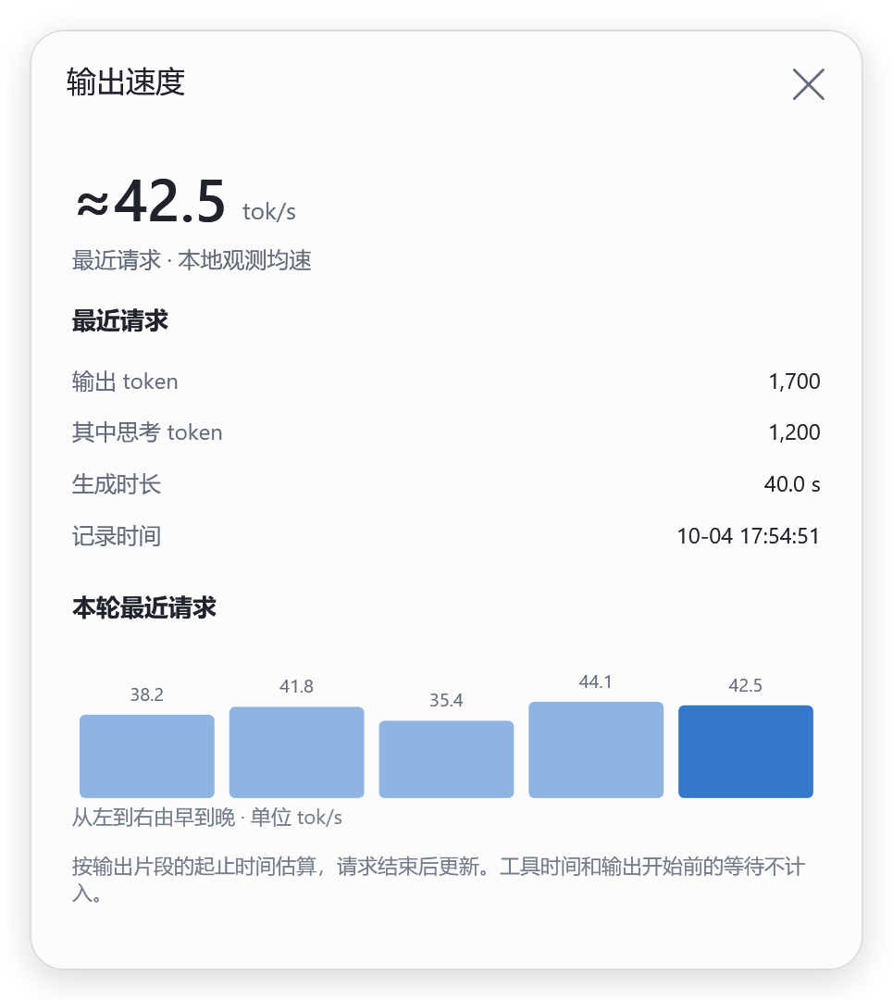

# 指标与检测范围

## 状态和性能

| 指标 | 口径 |
| --- | --- |
| 上下文 | 最近一次 `last_token_usage.total_tokens / model_context_window` 采样，和累计用量分开 |
| 缓存命中 | 最近请求的 `cached_input_tokens / input_tokens`，分母缺失时显示未知 |
| 本轮等待 | 尚未观察到响应时的经过时间，不是首 token 延迟 |
| 首字（观测） | 本轮开始到首条助手消息启动的间隔，不是屏幕绘制时间 |
| 首字（日志） | 日志提供的 `time_to_first_token_ms`；趋势只采用此口径 |
| 输出速度 | 最近一次模型请求的输出 token ÷ 对应输出片段的生成时长，单位 tok/s，本地观测均速 |
| 思考/响应（估算） | 连续观察到任务运行且没有工具执行时的累计时间，可能包含模型计算、生成回复、排队和网络等待 |
| 工具调用 | 本轮已知工具执行区间的并集，扣除明确的等待操作和上下文整理区间 |
| 可见进度（详情） | 距最近一次观察到的进度变化，不代表服务端是否仍在计算 |

本轮运行中不使用上轮首字数据占位。中途接入而缺少时点时显示“已输出／时点未记录”；断线或数据过期时不继续增加等待计时。任务完成后若缺少本轮日志值，最近记录会明确标注。

### 输出速度

浮窗在三项指标下方显示 `≈42.5 tok/s · 最近请求`，点击可看输出数量、其中思考 token、生成时长和本轮最近 8 次请求。每条请求用量记录落盘后更新；它不是逐 token 的瞬时测速，等待或任务结束时不会继续改变分母。

- 分子只取同一轮、同一响应 ID 的 `token_usage_record.usage.output_tokens`，不使用累计 token、输入 token、可见字数或 UI 的重复计数。输出数量包含思考、工具参数及模型生成的非可见结构，口径见 [官方 token 计数说明](https://developers.openai.com/api/docs/guides/token-counting)。
- 分母从该次生成的首个有明确开始时间的助手／思考片段，算到最后一个生成片段结束。工具结果、上下文整理和上一请求用量记录分隔生成区间，不把整轮耗时当作输出时间。快工具可能先于用量日志写完，之后的工具结果不会抹掉前一个请求的速度。
- 时间来自本机日志，可能含流式传输间隔，因此以 `≈` 显示，不宣称服务端纯解码速度。
- 缺失起止时点、跨越不明确边界、记录被裁剪或样本不足 250ms 时不猜测速度；新一轮不会借用上一轮数值。普通断线后保留的数字仍明确标为最近请求记录。

性能详情展示同一任务、相同模型与思考强度下的首字趋势，以及压缩记录。上下文大、缓存低或长时间没有可见进度都只作为排查线索，不自动判为卡死。

主面板仅展示当前阶段及该阶段持续时间，阶段变化时重新计时。并行工具条目每 3 秒轮换；断线或超过 5 秒没有有效观测时隐藏阶段计时。切回同一任务且确认仍是同一阶段时，恢复原起点。结束、中断或失败不保留增长中的阶段数字。本轮累计耗时和分类占比仅在性能详情中显示。

切换期间是否仍为同一阶段，按任务、本轮及工具／压缩记录核对；离开期间有新调用则更新起点。保留最多 128 个已移出完整缓存的任务起点，只在采集进程内有效。阶段持续时间可以跨越离开时间，性能详情中的已观测模型耗时不会补算缺失区间。工具调用只依据明确状态或开始/结束记录，缺少状态的历史摘要不会自动视为运行中。

模型名称的来源及缺失情况见 [上游模型](models.md)。

性能详情按墙钟时间分为思考/响应、工具调用、等待你操作、上下文整理、其他／未分类。并行工具区间取并集，不把各工具时长直接相加；等待操作优先于上下文整理，上下文整理优先于工具区间，三者优先于模型阶段估算，每毫秒只归类一次。

工具采用日志起止时点、明确的时点与持续时间，或从首次观察到执行开始的区间。历史运行态只有持续时间、没有起止依据时，不倒推出一个虚假的时间区间。模型、等待与整理的轮询观测只连接相邻且间隔不超过 5 秒的采样；断线、切换任务、中途接入和长采样间隔保留为未分类。这些观测只保留在当前采集进程，重启后无法从日志恢复的部分仍为未分类。

“其他／未分类”可能包含模型、排队、网络、输出等过程，不能当成模型纯计算时间。完成后的总耗时固定，不随查看旧对话继续增长。

## 工具调用与告警

| 等级 | 表现 |
| --- | --- |
| Info | 普通结果或原因未明的非零退出，保留在记录中 |
| Warning | 明确超时、缺失或可疑内容，在详情中呈现 |
| Error | 有明确执行失败、权限拒绝等证据，在详情中呈现 |
| Critical | 明确的工具服务启动或初始化故障，突出并自动展开 |

同一个 Critical 提示手动收起后不会反复顶开。普通命令无输出、`rg` 未匹配、`git diff` 检测到差异，不会直接当作严重故障；复合命令不会套用单个子命令的退出码含义。

工具可用性检查另行读取 MCP 服务目录，参见 [工具目录说明](tool-capabilities.md)。目录已登记不等于执行成功，未注册而没有产生日志的工具也可能无法形成调用记录。

## 账号额度与本机等效金额

剩余比例、周期与重置时间来自客户端返回的账号数据。本机记录按缓存、模型和已记录的速度等因素计算参考等效金额。用量不完整、无法计价或样本不足时，不显示总额推算。

“计入 Astra 长上下文加价”默认关闭，“Fast 折算普通额度”默认开启。两个开关仅影响本地估算，不改变 Codex 的设置。金额不是官方余额、账单或固定订阅上限；其他设备的用量无法从本机日志恢复。计算细节见 [额度说明](weekly-quota.md)。

账号额度详情中的“每周记录”从启用功能起保留当前账号的周期采样，最多 26 个周期。周期按接口重置时点划分；历史使用同一采样时刻的已用比例和本机用量，不将缺失的末段补成 100% 或全周账单。结束前未采样的间隔会在历史详情标明。各账号隔离，切换换算开关仅重算已保存的数值组成，不修改历史比例或 API 标价。

## 数据与边界

采集器读取 `CODEX_HOME`（默认 `%USERPROFILE%\.codex`）下的任务元数据与会话日志，通过本机 CDP 读取当前任务、工具目录和额度。自身设置与派生缓存位于 `%LOCALAPPDATA%\CodexEnhance`。对话内容不上传到本工具的外部服务，源日志不会被修改；账号状态查询由已登录的 Codex 客户端处理。

用量缓存不保存提示词、回复、命令、凭据、原始账号 ID 或完整源文件路径；标识经加盐哈希处理。诊断导出使用字段白名单。客户端内部结构改变可能导致部分指标暂不可用，多窗口、多显示器行为仍需更多实机验证。
